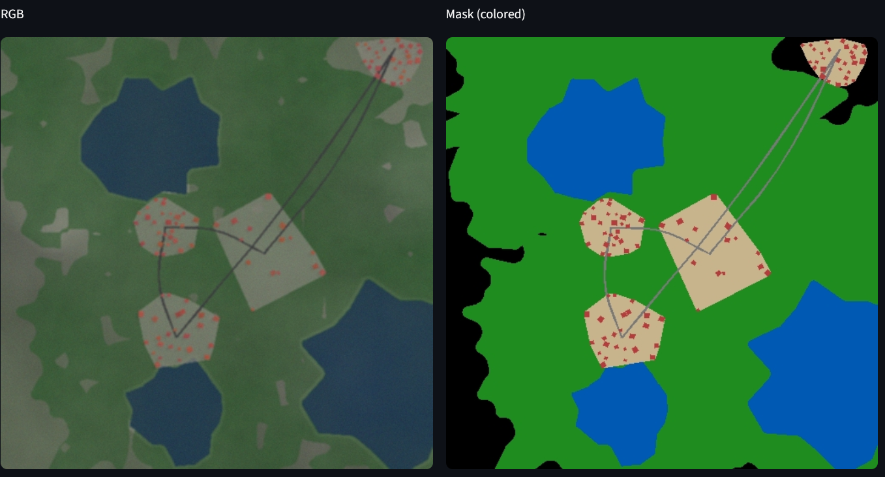
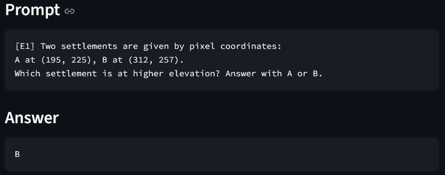

# 🛰️ GeoSynthBench

Synthetic Geospatial Dataset for Structured Reasoning Evaluation

<p align="left">      </p>

## Overview

GeoSynthBench is a controllable synthetic data generator for evaluating structured geospatial reasoning in multimodal models.
Rather than testing only perception, it aims at probing: Spatial & topological reasoning, Temporal change understanding, Counterfactual reasoning, Uncertainty handling...

Each example includes rendered world state (t₀, optional t₁), a reasoning question, and deterministic ground-truth answers.
The project development is currently minimal.

## 🚀 Demo

This project provides a minimal end-to-end demo: Generate a small synthetic dataset, Launch the interactive dataset viewer

```bash
uv sync
uv run python scripts/generation_demo.py
uv run streamlit run apps/view_dataset_app.py
```

#### Generated image (RGB + Semantic mask) with associated task and annotation

<p >
  
  <!--  -->
</p>

```
Prompt:
  [E1] Two settlements are given by pixel coordinates:
  A at (195, 225), B at (312, 257).
  Which settlement is at higher elevation? Answer with A or B.

Answer:
  B
```

**Remark** One might notice a significant weakness in this setup. By providing precise pixel coordinates, we explicitly tell the model where the entities are located. While this removes ambiguity, it also bypasses a realistic challenge: visually identifying the correct entities directly from the image.

In real-world scenarios, entities are rarely specified by exact coordinates. They must be located through visual cues such as color variation, landmarks, spatial context, or structural patterns. Supplying pixel coordinates therefore simplifies the localization step and shifts the difficulty toward symbolic abstraction rather than full visual grounding.

In short, this design reduces perceptual difficulty while increasing abstraction demands: the model reasons over spatial references, but is partially relieved from the task of discovering the entities visually.

## Why This Project?

### Limitations of Current VLM Datasetsand benchmarks

Most existing vision-language benchmarks:

- Emphasize object detection or captioning
- Lack structured geospatial reasoning
- Do not provide deterministic geometric ground truth
- Avoid graph/topology-based reasoning
- Rarely support controlled synthetic variation

As a consequence, models trained on these datasets tend to learn isolated **descriptive pattern recognition** rather than **structured spatial or temporal reasoning**. They perform well on “what is visible?” tasks, but struggle with topology, aggregation, connectivity, and temporal change analysis.

GeoSynthBench addresses these gaps.

### Task Scope & Reasoning Dimensions

Real-world geospatial problems involve layered spatial structure, evolving infrastructure, regulatory constraints, and long-term dynamics. Their complexity is effectively unbounded: small structural changes can propagate through networks, accessibility, land use, and policy constraints. Capturing this kind of reasoning requires more than perception — it requires structured, grounded world modeling.

GeoSynthBench is built around a symbolic world state that can generate diverse configurations through parameterized procedural rules. This allows controlled variation while preserving real-world spatial structure and causal consistency.

Tasks span multiple reasoning dimensions, without enforcing a strict hierarchy:

- **Perception** — object detection, localization, counting
- **Topology** — connectivity, intersections, graph-based structure
- **Temporal** — change detection, disruption analysis, evolution over time
- **Policy** — zoning compliance, rule violations, constraint checking
- **Counterfactual / Uncertainty** — hypothetical scenarios and conditional reasoning

## System Design

### 1. Structured World Modelisation

Each sample is generated from a symbolic WorldState, similar to how video games procedurally generate structurally realistic world configurations. A set of spatial rules and constraints governs how terrain, infrastructure, and settlements interact, producing coherent but diverse environments.

Due to the limited time span of this project, we deliberately restrict complexity: only a small number of entity types are introduced, governed by a limited set of physical, behavioral, anthropological, and natural rules. The goal is not to replicate full real-world richness, but to build a controlled and interpretable sandbox for spatial reasoning.

We also constrain the spatial scale to 512×512 grids at 5 meters per pixel (~2.5 km × 2.5 km). This is a deliberate compromise between spatial detail, geographic span, and computational cost. It allows meaningful topological and terrain reasoning while remaining lightweight to generate and render. Extending the framework to multi-scale reasoning (varying resolution and extent) would be a natural and interesting future direction.

Each sample is generated from a `WorldState` containing by order of generation:

- Terrain (height field with default background)
- Water bodies (polygons)
- Vegetation (polygons)
- Settlements
- Roads (graph structure)
- Buildings

All reasoning is computed from geometry and never from image pixels thus ensuring deterministic, traceable ground truth.

### 2. Pixel-Level Realism & Anti–Shortcut Design

Realism in GeoSynthBench is not primarily photographic — it is pixel-structural. The objective is not to produce visually beautiful imagery, but to prevent models from exploiting trivial color or shape shortcuts (“AI slope”).

If geometry is rendered with flat colors and sharp boundaries, tasks can often be solved through simple pixel heuristics. To avoid this, we introduce controlled texture rendering and low-level artifacts that better mimic satellite acquisition:

- Elevation-based shading and soft shadow effects
- Water shore gradients and boundary irregularities
- Texture noise in vegetation and terrain
- Slight smoothing and edge blending
- Blur, compression artifacts, and mild post-processing
- Domain-randomized color palettes

These simple rules are sufficient to create ambiguity at the pixel level while preserving perfect geometric ground truth. The goal is to make the image a noisy observation of an underlying structured world to get closer to how real satellite data behaves without breaking determinism.

By separating symbolic world modeling from texture rendering, we ensure that reasoning remains grounded in geometry, while perception remains non-trivial and resistant to shallow pattern matching.

### 3. Synthetic Scene Generation

For each sample, the pipeline follows these steps:

1. **Select a task** and configure the relevant world-generation parameters.
2. **Generate the geometric world state (`t0`)**.
   - If the task is temporal, apply a change operator to produce `t1` (limited to two timestamps for simplicity).
   - Check relevance for the task
3. **Render observations**: RGB image and semantic mask.
4. **Compute the deterministic oracle** directly from geometry and topology.
   - Check relevance for the task
5. **Generate the natural-language reasoning prompt** associated with the task.
6. **Serialize everything into JSONL format**, including images, metadata, prompt, and ground-truth answer.

This ensures that each sample is fully reproducible, geometrically grounded, and evaluation-ready.

## Implemented Tasks

| Task                       | Question                                    | Oracle                                    | Interest                                    | Pitfall                                             |
| -------------------------- | ------------------------------------------- | ----------------------------------------- | ------------------------------------------- | --------------------------------------------------- |
| **E1 — Elevation**         | Which settlement is at higher elevation?    | Mean elevation from height field          | Topographic reasoning beyond visual shading | Strong shading may reduce task to perception        |
| **D1 — Distance to Water** | Which settlement is closer to water?        | Min geometric distance to water polygon   | Spatial proximity & geometric measurement   | Clear shoreline contrast may enable pixel shortcuts |
| **S1 — Slope**             | Which settlement lies on steeper terrain?   | Local terrain slope at settlement center  | Gradient reasoning (not just elevation)     | Subtle slope differences may be visually ambiguous  |
| **N1 — Network Isolation** | Which settlement is most isolated?          | Mean shortest-path distance in road graph | Explicit graph & topological reasoning      | Peripheral road layouts may visually reveal answer  |
| **A1 — Temporal Addition** | How many new buildings after adding a road? | Building count difference (`t1 - t0`)     | Temporal reasoning & causal attribution     | Simple pixel differencing may solve trivial cases   |

## Dataset Format

Each sample is stored as **one JSON object per line** (`.jsonl`).
The schema slightly differs for **single-timestamp** and **temporal (pair)** tasks.

---

#### Single-Timestamp Tasks (`modality: "single"`)

Used for tasks such as E1, D1, S1, N1.

```json
{
  "sample_id": "00012",
  "task_code": "D1",
  "task_name": "Distance to water comparison",
  "modality": "single",
  "inputs": {
    "image": "data/D1/00012/rgb.png",
    "mask": "data/D1/00012/mask.png"
  },
  "prompt": "...",
  "answer": "A",
  "oracle": {
    "A": {
      "settlement_id": "s0",
      "px": [195, 225],
      "dist_to_water_m": 132.4
    },
    "B": {
      "settlement_id": "s1",
      "px": [312, 257],
      "dist_to_water_m": 248.7
    }
  }
}
```

#### Temporal Tasks (`modality: "pair"`)

Used for tasks involving changes between `t0` and `T1` (e.g., A1).

```json
{
  "sample_id": "00042",
  "task_code": "A1",
  "task_name": "Building addition after new road",
  "modality": "pair",
  "inputs": {
    "t0_image": "data/A1/00042/t0_rgb.png",
    "t1_image": "data/A1/00042/t1_rgb.png",
    "t0_mask": "data/A1/00042/t0_mask.png",
    "t1_mask": "data/A1/00042/t1_mask.png",
    "change_mask": "data/A1/00042/change_mask.png"
  },
  "prompt": "...",
  "answer": 5,
  "oracle": {
    "new_settlement_id": "s3",
    "new_road_id": "r7",
    "new_building_ids": ["b12", "b13", "b14", "b15", "b16"],
    "new_settlement_center_px": [210, 380],
    "new_road_endpoints_px": [
      [200, 370],
      [260, 410]
    ],
    "new_building_centers_px": [[205, 372]],
    "answer_int": 5
  }
}
```

## Visualization

Once you have generated a dataset, you can explore it interactively with the Streamlit viewer:

```bash
uv run streamlit run scripts/view_dataset.py
```

## Design Philosophy

GeoSynthBench is built around a deterministic oracle: every answer is computed directly from the symbolic world model, ensuring traceability and exact evaluation. The system avoids unnecessary over-engineering, favoring simple, interpretable components over complex abstractions.

The pipeline is modular, allowing tasks, generation, rendering, and evaluation to evolve independently. Reasoning is geometry-first — images are treated as observations of an underlying structured world. Finally, synthetic generation is fully reproducible through controlled seeds, enabling consistent experiments and ablations.

## Future Work

Future extensions include richer temporal change reasoning beyond simple two-timestamp setups, as well as multi-hop spatial reasoning that combines geometry, topology, and aggregation in a single query. Difficulty scaling could be made adaptive, increasing structural complexity, entity density, or graph depth.

On the modeling side, systematic VLM fine-tuning experiments would help quantify the impact of structured synthetic data. Finally, exploring real-to-synthetic transfer and vice versa would assess how well learned reasoning primitives generalize to real geospatial imagery.

## 📦 Pregenerated Dataset

You can download directly a demo size dataset (~24 MB):

🔗 **Direct download:**
[https://drive.google.com/file/d/1marE950KYRJSOEAM2acJEVgMn-UGZs-T/view?usp=drive_link
](https://drive.google.com/file/d/1marE950KYRJSOEAM2acJEVgMn-UGZs-T/view?usp=drive_link)

Or a larger pre-generated dataset (~0.8 GB):

🔗 **Direct download:**
[https://drive.google.com/file/d/19ZKSbyispv3kUBqShRsLfaUA0I9xRVSF/view?usp=drive_link
](https://drive.google.com/file/d/19ZKSbyispv3kUBqShRsLfaUA0I9xRVSF/view?usp=drive_link)
